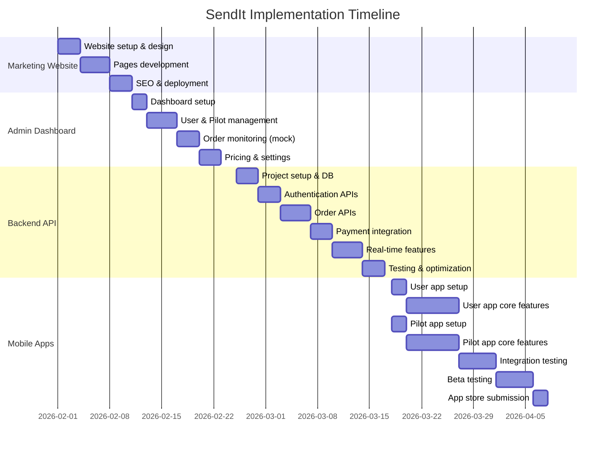

# Revised Implementation Order

## Development Sequence

Based on strategic priorities, we'll build in this order:

### Phase 1: Marketing Website (Week 1-2)
**Why First:** Establish online presence, collect leads, validate market interest

- Public-facing Next.js website
- No backend dependency (static/minimal API)
- Quick to deploy
- Start marketing early

### Phase 2: Admin Dashboard (Week 3-5)
**Why Second:** Build internal tools while backend is being developed

- Next.js admin portal
- Can mock backend APIs initially
- Prepare for pilot onboarding
- Configure pricing & settings

### Phase 3: Backend API (Week 6-9)
**Why Third:** Core infrastructure to power mobile apps

- Node.js + Express API
- PostgreSQL database
- Real-time features (Socket.io)
- Integration with external services

### Phase 4: Mobile Applications (Week 10-16)
**Why Last:** Requires stable backend, benefits from admin tools being ready

- User App (Flutter)
- Pilot App (Flutter)
- End-to-end testing
- App store deployment

---

## Detailed Timeline

---

## Advantages of This Approach

### ✅ Website First
- Immediate online presence
- Start lead generation early
- Validate market demand
- No technical dependencies
- Quick win for morale

### ✅ Admin Dashboard Second
- Internal tools ready before launch
- Team can configure system
- Pilot verification workflow ready
- Can use mock data initially
- Learn Next.js before backend complexity

### ✅ Backend Third
- Clear requirements from web builds
- Admin dashboard can integrate incrementally
- Solid foundation for mobile apps
- Can deploy behind the scenes

### ✅ Mobile Apps Last
- Mature backend APIs available
- Admin tools ready for support
- Can onboard pilots immediately
- Final polish with all systems working

---

## Benefits Over Traditional Approach

| Aspect | Traditional (Backend First) | New Approach (Website First) |
|--------|---------------------------|----------------------------|
| **Time to Market** | 6 weeks | 2 weeks (website live) |
| **User Acquisition** | Starts at launch | Starts immediately |
| **Learning Curve** | Backend complexity first | Easier web dev first |
| **Risk** | Big bang launch | Incremental validation |
| **Marketing** | Last minute | Early & continuous |
| **Feedback** | Post-launch only | Throughout development |

---

**Status:** Ready for implementation  
**Start Date:** Now  
**First Milestone:** Website live in Week 2
