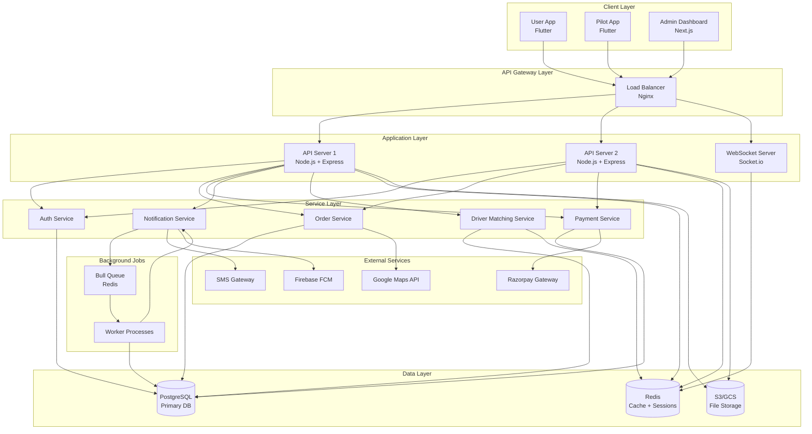
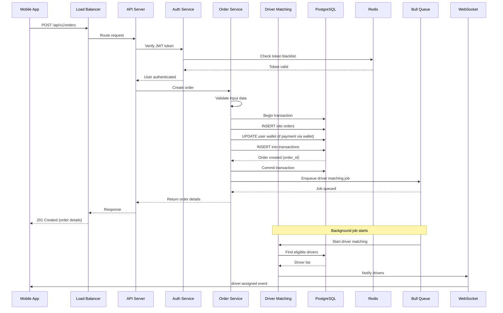

# Backend API - Detailed Planning Document

## 1. Overview

The backend serves as the core infrastructure connecting User App, Pilot App, and Admin Dashboard with real-time communication, payment processing, and order management.

## 2. Technology Stack

### Core
- **Runtime:** Node.js 18+ LTS
- **Framework:** Express.js 4.x
- **Language:** TypeScript for type safety
- **API Style:** RESTful + WebSocket (Socket.io)

### Database
- **Primary:** PostgreSQL 15+ (ACID compliance, complex queries)
- **Cache:** Redis 7+ (sessions, real-time data, queues)
- **ORM:** Prisma or TypeORM

### Real-Time
- **Socket.io:** Driver location updates, order status
- **Redis Pub/Sub:** Event broadcasting

### Background Jobs
- **Bull Queue:** Payment processing, notifications, reports

### File Storage
- **AWS S3 / Google Cloud Storage:** Documents, delivery photos

---

## 2.1 System Architecture Diagram



---

## 2.2 Request Flow: Order Creation



---

## 3. Database Schema

### 3.1 Users Table
```sql
CREATE TABLE users (
  id UUID PRIMARY KEY DEFAULT gen_random_uuid(),
  phone VARCHAR(15) UNIQUE NOT NULL,
  country_code VARCHAR(5) DEFAULT '+91',
  email VARCHAR(255),
  name VARCHAR(100),
  profile_image TEXT,
  age INTEGER,
  wallet_balance DECIMAL(10,2) DEFAULT 0.00,
  referral_code VARCHAR(10) UNIQUE,
  referred_by UUID REFERENCES users(id),
  status VARCHAR(20) DEFAULT 'active', -- active, suspended, deleted
  created_at TIMESTAMP DEFAULT NOW(),
  updated_at TIMESTAMP DEFAULT NOW(),
  last_login TIMESTAMP
);

CREATE INDEX idx_users_phone ON users(phone);
CREATE INDEX idx_users_referral_code ON users(referral_code);
```

### 3.2 Pilots Table
```sql
CREATE TABLE pilots (
  id UUID PRIMARY KEY DEFAULT gen_random_uuid(),
  phone VARCHAR(15) UNIQUE NOT NULL,
  country_code VARCHAR(5) DEFAULT '+91',
  email VARCHAR(255),
  name VARCHAR(100),
  profile_image TEXT,
  age INTEGER,
  date_of_birth DATE,
  address TEXT,
  city VARCHAR(100),
  state VARCHAR(100),
  pincode VARCHAR(10),
  
  -- Verification
  verification_status VARCHAR(20) DEFAULT 'pending', -- pending, approved, rejected
  documents JSONB, -- {id_proof, license, vehicle_rc, parental_consent}
  background_check_status VARCHAR(20),
  
  -- Performance
  rating DECIMAL(3,2) DEFAULT 0.00,
  total_rides INTEGER DEFAULT 0,
  completed_rides INTEGER DEFAULT 0,
  cancelled_rides INTEGER DEFAULT 0,
  
  -- Financials
  wallet_balance DECIMAL(10,2) DEFAULT 0.00,
  total_earnings DECIMAL(10,2) DEFAULT 0.00,
  
  -- Status
  online_status BOOLEAN DEFAULT false,
  current_location GEOGRAPHY(POINT),
  last_location_update TIMESTAMP,
  
  -- Referral
  referral_code VARCHAR(10) UNIQUE,
  
  created_at TIMESTAMP DEFAULT NOW(),
  updated_at TIMESTAMP DEFAULT NOW()
);

CREATE INDEX idx_pilots_phone ON pilots(phone);
CREATE INDEX idx_pilots_online ON pilots(online_status);
CREATE INDEX idx_pilots_location ON pilots USING GIST(current_location);
```

### 3.3 Vehicles Table
```sql
CREATE TABLE vehicles (
  id UUID PRIMARY KEY DEFAULT gen_random_uuid(),
  pilot_id UUID REFERENCES pilots(id) ON DELETE CASCADE,
  vehicle_type VARCHAR(50), -- cycle, ev_cycle, 2_wheeler, 3_wheeler, truck
  vehicle_category VARCHAR(50), -- ev, cng, diesel, petrol
  vehicle_number VARCHAR(20) UNIQUE,
  vehicle_model VARCHAR(100),
  registration_certificate TEXT,
  insurance_document TEXT,
  pollution_certificate TEXT,
  is_active BOOLEAN DEFAULT false,
  battery_percentage INTEGER, -- for EVs
  max_weight_kg INTEGER,
  max_distance_km INTEGER,
  created_at TIMESTAMP DEFAULT NOW(),
  updated_at TIMESTAMP DEFAULT NOW()
);

CREATE INDEX idx_vehicles_pilot ON vehicles(pilot_id);
CREATE INDEX idx_vehicles_active ON vehicles(is_active);
```

### 3.4 Vehicle Pricing Table
```sql
CREATE TABLE vehicle_pricing (
  id UUID PRIMARY KEY DEFAULT gen_random_uuid(),
  vehicle_type VARCHAR(50) NOT NULL,
  vehicle_category VARCHAR(50),
  base_fare DECIMAL(8,2) NOT NULL,
  per_km_rate DECIMAL(8,2) NOT NULL,
  max_weight_kg INTEGER,
  max_distance_km INTEGER,
  surge_multiplier DECIMAL(3,2) DEFAULT 1.00,
  is_active BOOLEAN DEFAULT true,
  icon_url TEXT,
  display_name VARCHAR(100),
  description TEXT,
  created_at TIMESTAMP DEFAULT NOW(),
  updated_at TIMESTAMP DEFAULT NOW()
);
```

### 3.5 Orders Table
```sql
CREATE TABLE orders (
  id UUID PRIMARY KEY DEFAULT gen_random_uuid(),
  order_number VARCHAR(20) UNIQUE NOT NULL,
  user_id UUID REFERENCES users(id),
  pilot_id UUID REFERENCES pilots(id),
  
  -- Service Type
  service_type VARCHAR(20) DEFAULT 'goods', -- goods, passenger
  
  -- Locations
  pickup_address TEXT NOT NULL,
  pickup_lat DECIMAL(10,8) NOT NULL,
  pickup_lng DECIMAL(11,8) NOT NULL,
  drop_address TEXT NOT NULL,
  drop_lat DECIMAL(10,8) NOT NULL,
  drop_lng DECIMAL(11,8) NOT NULL,
  
  -- Additional stops for bulk delivery
  additional_stops JSONB, -- [{address, lat, lng, sequence}]
  
  -- Package Details
  package_details JSONB, -- {weight, description, fragile, goods_type}
  load_assist_required BOOLEAN DEFAULT false,
  
  -- Vehicle & Pricing
  vehicle_type VARCHAR(50) NOT NULL,
  vehicle_category VARCHAR(50),
  distance_km DECIMAL(8,2),
  estimated_duration_mins INTEGER,
  
  base_fare DECIMAL(8,2),
  distance_fare DECIMAL(8,2),
  surge_multiplier DECIMAL(3,2) DEFAULT 1.00,
  subtotal DECIMAL(8,2),
  cgst DECIMAL(8,2),
  sgst DECIMAL(8,2),
  discount DECIMAL(8,2) DEFAULT 0.00,
  coupon_code VARCHAR(20),
  total_amount DECIMAL(8,2) NOT NULL,
  
  -- Payment
  payment_method VARCHAR(20), -- cash, card, wallet, upi
  payment_status VARCHAR(20) DEFAULT 'pending', -- pending, completed, failed, refunded
  payment_transaction_id VARCHAR(100),
  
  -- Scheduling
  is_scheduled BOOLEAN DEFAULT false,
  scheduled_date DATE,
  scheduled_time TIME,
  
  -- Status
  status VARCHAR(30) DEFAULT 'pending', -- pending, searching_driver, assigned, picked_up, in_transit, delivered, cancelled
  
  -- Timestamps
  created_at TIMESTAMP DEFAULT NOW(),
  driver_assigned_at TIMESTAMP,
  picked_up_at TIMESTAMP,
  delivered_at TIMESTAMP,
  cancelled_at TIMESTAMP,
  
  -- Photos
  pickup_photo TEXT,
  delivery_photo TEXT,
  
  -- Ratings
  user_rating INTEGER,
  user_feedback TEXT,
  pilot_rating INTEGER,
  
  -- Cancellation
  cancelled_by VARCHAR(20), -- user, pilot, admin
  cancellation_reason TEXT,
  
  updated_at TIMESTAMP DEFAULT NOW()
);

CREATE INDEX idx_orders_user ON orders(user_id);
CREATE INDEX idx_orders_pilot ON orders(pilot_id);
CREATE INDEX idx_orders_status ON orders(status);
CREATE INDEX idx_orders_created ON orders(created_at DESC);
CREATE INDEX idx_orders_scheduled ON orders(is_scheduled, scheduled_date, scheduled_time);
```

### 3.6 Addresses Table
```sql
CREATE TABLE addresses (
  id UUID PRIMARY KEY DEFAULT gen_random_uuid(),
  user_id UUID REFERENCES users(id) ON DELETE CASCADE,
  label VARCHAR(50), -- home, work, other
  full_address TEXT NOT NULL,
  lat DECIMAL(10,8) NOT NULL,
  lng DECIMAL(11,8) NOT NULL,
  landmark TEXT,
  is_default BOOLEAN DEFAULT false,
  created_at TIMESTAMP DEFAULT NOW(),
  updated_at TIMESTAMP DEFAULT NOW()
);

CREATE INDEX idx_addresses_user ON addresses(user_id);
```

### 3.7 Transactions Table
```sql
CREATE TABLE transactions (
  id UUID PRIMARY KEY DEFAULT gen_random_uuid(),
  user_id UUID REFERENCES users(id),
  pilot_id UUID REFERENCES pilots(id),
  order_id UUID REFERENCES orders(id),
  
  transaction_type VARCHAR(20), -- credit, debit
  category VARCHAR(30), -- order_payment, wallet_topup, referral_bonus, withdrawal, refund
  
  amount DECIMAL(10,2) NOT NULL,
  balance_before DECIMAL(10,2),
  balance_after DECIMAL(10,2),
  
  payment_method VARCHAR(20),
  payment_gateway VARCHAR(50),
  payment_reference VARCHAR(100),
  
  status VARCHAR(20) DEFAULT 'completed', -- pending, completed, failed
  description TEXT,
  
  created_at TIMESTAMP DEFAULT NOW()
);

CREATE INDEX idx_transactions_user ON transactions(user_id);
CREATE INDEX idx_transactions_pilot ON transactions(pilot_id);
CREATE INDEX idx_transactions_order ON transactions(order_id);
CREATE INDEX idx_transactions_created ON transactions(created_at DESC);
```

### 3.8 Referrals Table
```sql
CREATE TABLE referrals (
  id UUID PRIMARY KEY DEFAULT gen_random_uuid(),
  referrer_id UUID, -- Can be user or pilot
  referrer_type VARCHAR(10), -- user, pilot
  referee_id UUID, -- Can be user or pilot
  referee_type VARCHAR(10), -- user, pilot
  referral_code VARCHAR(10) NOT NULL,
  
  reward_amount DECIMAL(8,2),
  reward_points INTEGER,
  status VARCHAR(20) DEFAULT 'pending', -- pending, completed, expired
  
  completed_at TIMESTAMP,
  created_at TIMESTAMP DEFAULT NOW()
);

CREATE INDEX idx_referrals_referrer ON referrals(referrer_id, referrer_type);
CREATE INDEX idx_referrals_code ON referrals(referral_code);
```

### 3.9 Reward Points Table
```sql
CREATE TABLE reward_points (
  id UUID PRIMARY KEY DEFAULT gen_random_uuid(),
  user_id UUID REFERENCES users(id),
  pilot_id UUID REFERENCES pilots(id),
  
  points INTEGER NOT NULL,
  transaction_type VARCHAR(20), -- earned, redeemed, expired
  source VARCHAR(50), -- referral, ride, purchase, admin
  
  order_id UUID REFERENCES orders(id),
  referral_id UUID REFERENCES referrals(id),
  
  description TEXT,
  expires_at TIMESTAMP,
  created_at TIMESTAMP DEFAULT NOW()
);

CREATE INDEX idx_reward_points_user ON reward_points(user_id);
CREATE INDEX idx_reward_points_pilot ON reward_points(pilot_id);
```

### 3.10 Coupons Table
```sql
CREATE TABLE coupons (
  id UUID PRIMARY KEY DEFAULT gen_random_uuid(),
  code VARCHAR(20) UNIQUE NOT NULL,
  description TEXT,
  
  discount_type VARCHAR(20), -- percentage, fixed
  discount_value DECIMAL(8,2) NOT NULL,
  max_discount DECIMAL(8,2),
  min_order_value DECIMAL(8,2),
  
  usage_limit INTEGER,
  usage_count INTEGER DEFAULT 0,
  per_user_limit INTEGER DEFAULT 1,
  
  valid_from TIMESTAMP DEFAULT NOW(),
  valid_until TIMESTAMP,
  is_active BOOLEAN DEFAULT true,
  
  applicable_vehicle_types JSONB,
  applicable_user_types VARCHAR(20), -- all, new_users, specific
  
  created_at TIMESTAMP DEFAULT NOW(),
  updated_at TIMESTAMP DEFAULT NOW()
);

CREATE INDEX idx_coupons_code ON coupons(code);
CREATE INDEX idx_coupons_active ON coupons(is_active, valid_until);
```

### 3.11 Coupon Usage Table
```sql
CREATE TABLE coupon_usage (
  id UUID PRIMARY KEY DEFAULT gen_random_uuid(),
  coupon_id UUID REFERENCES coupons(id),
  user_id UUID REFERENCES users(id),
  order_id UUID REFERENCES orders(id),
  discount_amount DECIMAL(8,2),
  created_at TIMESTAMP DEFAULT NOW()
);

CREATE INDEX idx_coupon_usage_user ON coupon_usage(user_id, coupon_id);
```

### 3.12 Notifications Table
```sql
CREATE TABLE notifications (
  id UUID PRIMARY KEY DEFAULT gen_random_uuid(),
  user_id UUID REFERENCES users(id),
  pilot_id UUID REFERENCES pilots(id),
  
  title VARCHAR(200) NOT NULL,
  message TEXT NOT NULL,
  notification_type VARCHAR(30), -- order_update, promotional, system
  
  order_id UUID REFERENCES orders(id),
  data JSONB,
  
  is_read BOOLEAN DEFAULT false,
  read_at TIMESTAMP,
  
  created_at TIMESTAMP DEFAULT NOW()
);

CREATE INDEX idx_notifications_user ON notifications(user_id, created_at DESC);
CREATE INDEX idx_notifications_pilot ON notifications(pilot_id, created_at DESC);
```

## 4. API Endpoints

### 4.1 Authentication APIs

#### POST /api/v1/auth/send-otp
```json
Request:
{
  "phone": "9484707535",
  "country_code": "+91",
  "user_type": "user" // or "pilot"
}

Response:
{
  "success": true,
  "message": "OTP sent successfully",
  "otp_id": "uuid",
  "expires_in": 300
}
```

#### POST /api/v1/auth/verify-otp
```json
Request:
{
  "otp_id": "uuid",
  "otp": "123456",
  "phone": "9484707535"
}

Response:
{
  "success": true,
  "token": "jwt_token",
  "refresh_token": "refresh_token",
  "user": {
    "id": "uuid",
    "phone": "9484707535",
    "name": "John Doe",
    "email": "john@example.com",
    "is_new_user": false
  }
}
```

#### POST /api/v1/auth/refresh-token
#### POST /api/v1/auth/logout

### 4.2 User Management APIs

#### GET /api/v1/users/profile
#### PUT /api/v1/users/profile
#### GET /api/v1/users/addresses
#### POST /api/v1/users/addresses
#### PUT /api/v1/users/addresses/:id
#### DELETE /api/v1/users/addresses/:id

### 4.3 Order Management APIs

#### POST /api/v1/orders/estimate
```json
Request:
{
  "pickup_lat": 23.0225,
  "pickup_lng": 72.5714,
  "drop_lat": 23.0395,
  "drop_lng": 72.5661,
  "vehicle_type": "2_wheeler",
  "service_type": "goods"
}

Response:
{
  "success": true,
  "estimate": {
    "distance_km": 5.2,
    "duration_mins": 18,
    "base_fare": 54.00,
    "distance_fare": 26.00,
    "subtotal": 80.00,
    "cgst": 7.20,
    "sgst": 7.20,
    "total": 94.40,
    "available_vehicles": [...]
  }
}
```

#### POST /api/v1/orders
#### GET /api/v1/orders
#### GET /api/v1/orders/:id
#### PUT /api/v1/orders/:id/cancel
#### POST /api/v1/orders/:id/rate

### 4.4 Pilot APIs

#### POST /api/v1/pilots/register
#### PUT /api/v1/pilots/profile
#### POST /api/v1/pilots/documents
#### GET /api/v1/pilots/vehicles
#### POST /api/v1/pilots/vehicles
#### PUT /api/v1/pilots/vehicles/:id/activate
#### PUT /api/v1/pilots/online-status
#### PUT /api/v1/pilots/location
#### GET /api/v1/pilots/jobs/available
#### PUT /api/v1/pilots/jobs/:id/accept
#### PUT /api/v1/pilots/jobs/:id/decline
#### PUT /api/v1/pilots/jobs/:id/status
#### POST /api/v1/pilots/jobs/:id/photos
#### GET /api/v1/pilots/earnings

### 4.5 Payment APIs

#### POST /api/v1/payments/process
#### GET /api/v1/payments/methods
#### POST /api/v1/wallet/add-money
#### POST /api/v1/wallet/withdraw
#### GET /api/v1/wallet/transactions

### 4.6 Coupon APIs

#### GET /api/v1/coupons
#### POST /api/v1/coupons/validate
#### POST /api/v1/coupons/apply

### 4.7 Referral APIs

#### GET /api/v1/referrals/code
#### POST /api/v1/referrals/apply
#### GET /api/v1/referrals/stats
#### GET /api/v1/rewards/points

### 4.8 Admin APIs

#### GET /api/v1/admin/users
#### GET /api/v1/admin/pilots
#### PUT /api/v1/admin/pilots/:id/verify
#### GET /api/v1/admin/orders
#### GET /api/v1/admin/analytics
#### POST /api/v1/admin/pricing
#### POST /api/v1/admin/coupons

## 5. Real-Time Features (Socket.io)

### 5.1 Events

#### User App Events
- `order:created` - Order placed
- `driver:assigned` - Driver assigned with details
- `driver:location` - Live location updates
- `order:status_changed` - Status updates
- `order:delivered` - Delivery complete

#### Pilot App Events
- `job:new` - New job request
- `job:cancelled` - Job cancelled by user
- `order:updated` - Order details changed

### 5.2 Connection Flow
```javascript
// User connects
socket.on('connect', () => {
  socket.emit('user:online', { user_id, token });
});

// Pilot connects and shares location
socket.on('connect', () => {
  socket.emit('pilot:online', { pilot_id, token, location });
});

// Location updates every 5-10 seconds
socket.emit('pilot:location', { lat, lng, heading });
```

## 6. Background Jobs

### 6.1 Job Types

1. **Driver Matching Job**
   - Find available drivers near pickup location
   - Sort by distance, rating, and availability
   - Send job requests sequentially

2. **Scheduled Pickup Job**
   - Runs 10 minutes before scheduled time
   - Initiates driver search

3. **Payment Processing Job**
   - Handle payment gateway webhooks
   - Retry failed payments
   - Update order status

4. **Notification Job**
   - Send push notifications
   - Send SMS alerts
   - Send emails

5. **Analytics Job**
   - Generate daily reports
   - Update pilot earnings
   - Calculate platform metrics

## 7. Third-Party Integrations

### 7.1 Google Maps
- **Places API:** Address autocomplete
- **Geocoding API:** Address to coordinates
- **Directions API:** Route calculation
- **Distance Matrix API:** Distance/duration estimation

### 7.2 Payment Gateway (Razorpay)
- Order creation
- Payment collection
- Refund processing
- Webhook handling

### 7.3 SMS Gateway (MSG91)
- OTP delivery
- Order notifications
- Promotional messages

### 7.4 Firebase
- Push notifications (FCM)
- Analytics
- Crashlytics

## 8. Security Measures

### 8.1 Authentication
- JWT tokens with 24-hour expiry
- Refresh tokens with 30-day expiry
- Token blacklisting for logout
- Rate limiting on auth endpoints

### 8.2 Data Protection
- Input validation (Joi/Yup)
- SQL injection prevention (parameterized queries)
- XSS protection
- CORS configuration
- Helmet.js for security headers

### 8.3 API Security
- Rate limiting (express-rate-limit)
- Request size limits
- API key authentication for admin
- IP whitelisting for admin panel

## 9. Performance Optimization

### 9.1 Caching Strategy
- User sessions in Redis
- Frequently accessed data (pricing, vehicle types)
- API response caching
- Location data caching

### 9.2 Database Optimization
- Proper indexing
- Connection pooling
- Query optimization
- Read replicas for analytics

### 9.3 Scalability
- Horizontal scaling with load balancer
- Microservices architecture (future)
- CDN for static assets
- Database sharding (future)

## 10. Monitoring & Logging

### 10.1 Logging
- Winston for application logs
- Morgan for HTTP logs
- Structured logging (JSON format)
- Log levels (error, warn, info, debug)

### 10.2 Monitoring
- PM2 for process management
- Prometheus for metrics
- Grafana for dashboards
- Sentry for error tracking

## 11. Development Checklist

### Phase 1: Setup
- [ ] Initialize Node.js project with TypeScript
- [ ] Setup PostgreSQL database
- [ ] Setup Redis
- [ ] Configure ESLint and Prettier
- [ ] Setup environment configuration
- [ ] Create database schema
- [ ] Setup Prisma/TypeORM

### Phase 2: Core APIs
- [ ] Authentication system
- [ ] User management
- [ ] Pilot management
- [ ] Order management
- [ ] Payment integration
- [ ] Real-time socket setup

### Phase 3: Advanced Features
- [ ] Wallet system
- [ ] Referral system
- [ ] Coupon system
- [ ] Notification system
- [ ] Analytics APIs

### Phase 4: Testing & Deployment
- [ ] Unit tests
- [ ] Integration tests
- [ ] Load testing
- [ ] Security audit
- [ ] API documentation (Swagger)
- [ ] Deployment scripts

---

**Document Version:** 1.0  
**Last Updated:** 2026-01-29
