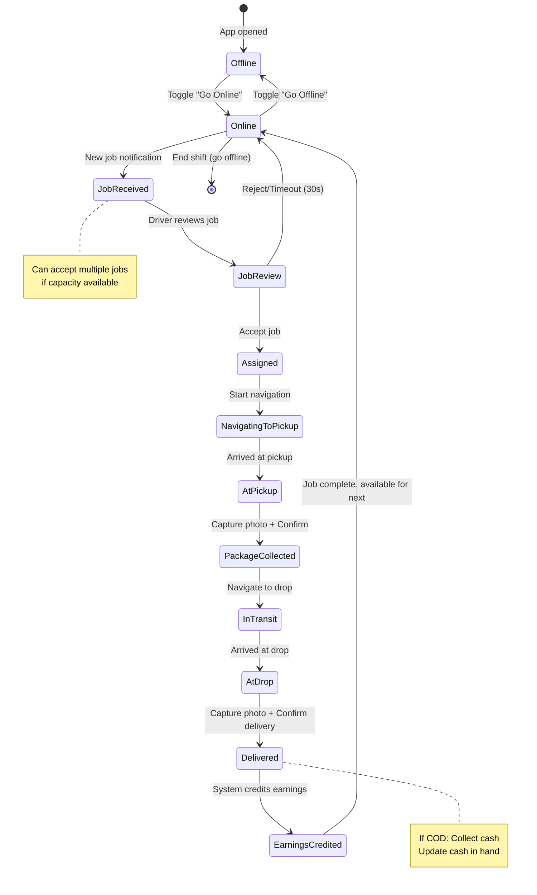

# SendIt Platform - Complete Flow Diagrams

## Overview
This document provides visual flow diagrams for all major workflows and scenarios in the SendIt platform.

---

## 1. Platform Architecture Overview


---

## 2. User Journey: Complete Order Flow

### 2.1 Order Creation & Driver Assignment


### 2.2 Delivery Process


---

## 3. Pilot Journey: Registration to First Job

### 3.1 Pilot Registration Flow


### 3.2 Pilot Daily Workflow



---

## 4. Payment Processing Flows

### 4.1 Wallet Payment Flow


### 4.2 Order Payment with Coupon


---

## 5. Admin Dashboard Workflows

### 5.1 Pilot Verification Workflow


### 5.2 Real-time Order Monitoring


---

## 6. Real-Time Communication Flows

### 6.1 Live Location Tracking


### 6.2 Push Notification Flow


---

## 7. Surge Pricing System


---

## 8. Referral System Flow


---

## 9. Error Handling & Retry Scenarios

### 9.1 Network Failure Handling


---

## 10. Cancellation Scenarios

### 10.1 User Cancellation Flow


---

## 11. Scheduled Delivery Flow

```mermaid
gantt
    title Scheduled Delivery Timeline
    dateFormat HH:mm
    axisFormat %H:%M
    
    section User Actions
    Book delivery for 6 PM          :done, booking, 14:00, 1m
    Receive confirmation            :done, confirm, 14:01, 1m
    
    section System Processing
    Store in scheduled_jobs table   :done, store, 14:02, 1m
    Wait until allocation time      :active, wait, 14:03, 225m
    
    section Driver Matching (5:30 PM)
    Start driver search             :crit, search, 17:30, 5m
    Assign driver                   :crit, assign, 17:35, 1m
    Notify user & driver            :milestone, notify, 17:36, 0m
    
    section Delivery Execution
    Driver picks up package         :active, pickup, 17:45, 10m
    In transit to customer          :active, transit, 17:55, 25m
    Delivered at 6:20 PM            :milestone, deliver, 18:20, 0m
```

---

## 12. Multi-Stop Delivery Flow


---

## 13. Wallet Withdrawal Flow (Pilot)


---

## 14. Support Ticket Workflow


---

## 15. Complete System Integration


---

**Document Version:** 1.0  
**Last Updated:** 2026-01-29  
**Purpose:** Visual reference for all platform workflows
